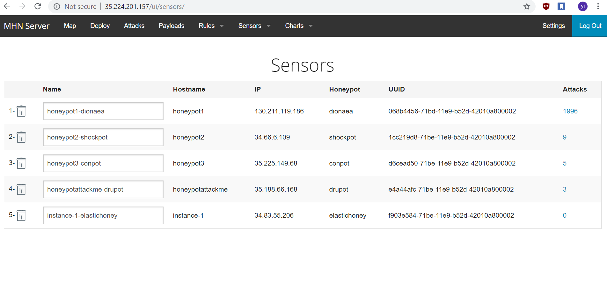
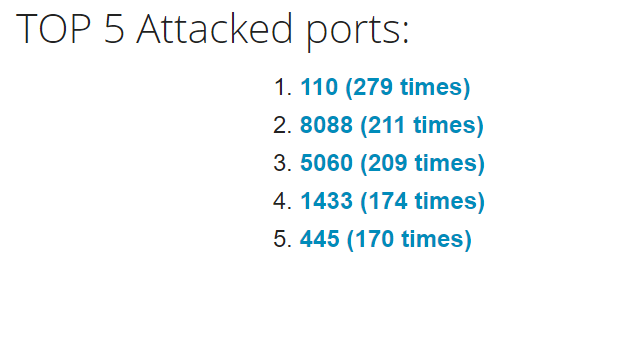
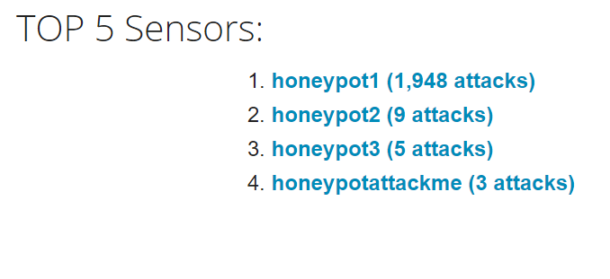
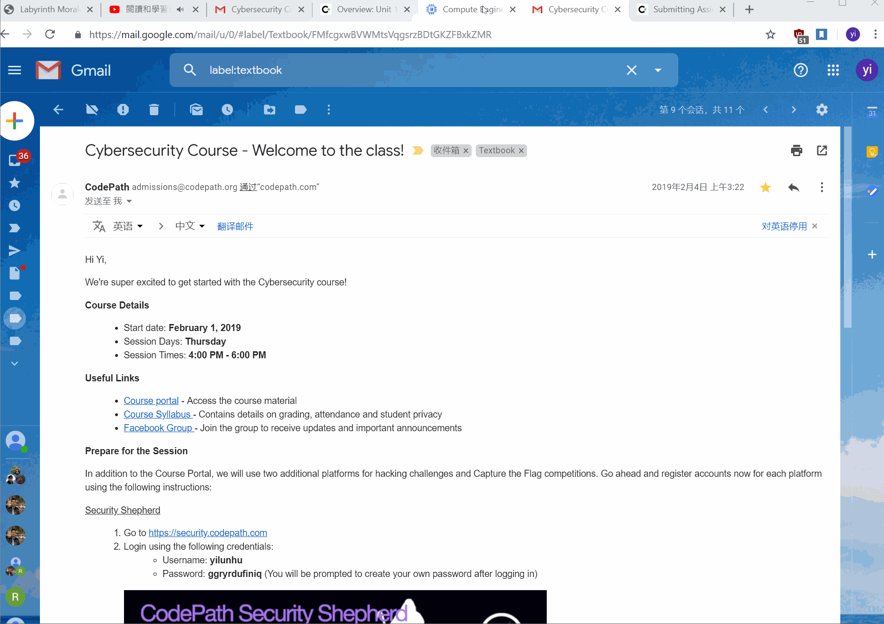

# Web-Security-Week10

## Which Honeypot(s) you deployed

## Any issues you encountered
I was confused by some of the instruction needed to set up the VM. 

## A summary of the data collected: 

## Any unresolved questions raised by the data collected
Why is some honey pots attacked more than the other?
